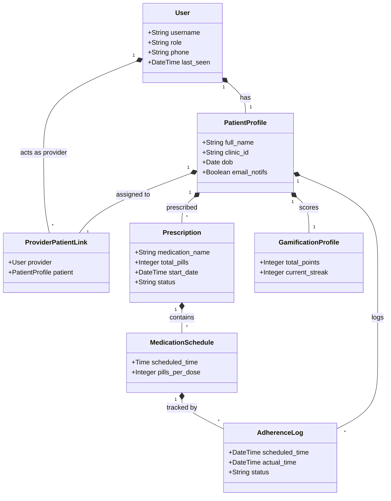
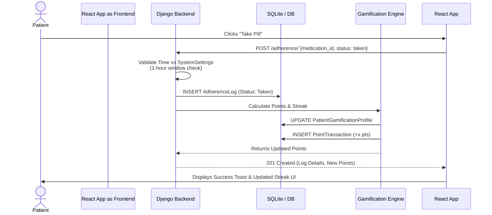

# System Architecture: ART Adherence Platform

This document outlines the core architecture of the ART Adherence application, a full-stack platform consisting of a Django REST Framework (DRF) backend and a React (Vite-based) frontend. It provides a structural and functional map of the models, APIs, and views designed for UML modeling and architectural review.

## 1. Conceptual Data Model (Backend)

The database schema is divided into functional clusters to maintain separation of concerns.

### Core Users & Roles

- **User (`AbstractUser`)**: Extended base user handling authentication. Uses role-based access control (`patient`, `provider`, `admin`).
- **PatientProfile**: Extended demographic and clinical data linked to a User. Contains notification preferences and consent flags.
- **ProviderPatientLink**: Relational mapping assigning patients to specific healthcare providers.

### Medical Data & Treatment

- **Prescription**: Defines the medication prescribed to a patient, including total pill counts and start/end dates.
- **MedicationSchedule**: The temporal configuration (e.g., daily at 08:00 AM) dictating when pills are taken.
- **AdherenceLog**: Transactional records for specific scheduled dose events. Tracks the status (`scheduled`, `taken`, `missed`, `snoozed`).
- **ViralLoadResult**: Clinical records tracking viral load test results chronologically.
- **ViralLoadReview**: Analytical summaries interpreting a `ViralLoadResult` against recent adherence metrics.

### Gamification & Engagement

- **PatientGamificationProfile**: Aggregator for a patient's current total points and active daily streaks.
- **PointTransaction**: An audit ledger of all points awarded or deducted.
- **Badge & WeeklyConsistencyBadge**: Achievement entities awarded for hitting adherence milestones.
- **Quote**: A library of motivational text categorized by mental, physical, emotional, or spiritual themes.

### Communication & Alerts

- **CounselingMessage**: Internal messaging system enabling provider-patient chats. Supports file attachments.
- **ReportFile**: System-generated exports (PDFs/files) of adherence or viral loads.
- **Alert**: Notifications (system-auto or provider-created) flagging patients needing attention.
- **RefillReminder**: Tracks dates indicating a patient's prescription is running out.
- **PushSubscription**: Stores P256DH and Auth tokens for Web Push API notifications.

### System Configuration

- **SystemSettings**: Singleton model storing global thresholds (e.g., adherence adherence windows, viral load thresholds).
- **AuditLog**: System-wide action tracking for compliance and security.

---

## 2. API Endpoints (REST Interface)

The unified REST API is exposed under `art_backend/adherence/urls.py` utilizing ViewSets and APIViews.

| Endpoint                           | Methods        | Primary Functionality                                      |
| :--------------------------------- | :------------- | :--------------------------------------------------------- |
| `/auth/token/`                     | POST           | Generates JWT Pair for authentication                      |
| `/patients/`                       | GET, POST, PUT | CRUD for `PatientProfile`, restricted by Role              |
| `/patients/<id>/adherence_report/` | GET            | Triggers document generation for adherence reports         |
| `/providers/me/dashboard/`         | GET            | Aggregates stats for the provider's assigned cohort        |
| `/patients/me/analytics/`          | GET            | Serves adherence charts, consistency, and trend data       |
| `/prescriptions/`                  | GET, POST, PUT | Create/update medication regimens                          |
| `/medications/`                    | GET, POST, PUT | Manage dosing schedules linked to prescriptions            |
| `/adherence/`                      | GET, POST, PUT | Core endpoint for fetching schedules and logging doses     |
| `/viral-loads/`                    | GET, POST      | Submitting and retrieving clinical viral load test results |
| `/gamification/`                   | GET            | Retrieves current points, streak, and recent badges        |
| `/chatbot/` & `/patient/ai-chat/`  | POST           | Interacts with the backend Google GenAI service agents     |
| `/messages/`                       | GET, POST      | Direct communication payload delivery and history          |
| `/admin/users/`                    | GET, POST, PUT | Top-level administration endpoint for user provisioning    |
| `/push/subscribe/`                 | POST           | Registers browser service workers for Push Notifications   |

---

## 3. Frontend Application Routing (React)

The frontend uses React Router, heavily guarded by a `ProtectedRoute` component to enforce Role-Based Access Control (RBAC).

### Patient Features (Role: `patient`)

- **`PatientHome` (`/patient`)**: The primary dashboard displaying today's medication schedule and quick-action logging buttons.
- **`Learn` (`/patient/learn`)**: Educational modules presenting fetched motivational quotes and health guides.
- **`Rewards` (`/patient/rewards`)**: Displays Gamification profile (streaks, points, earned badges).
- **`PatientAnalytics` (`/patient/analytics`)**: Visual representations (charts) of historical adherence rates.
- **`PatientHistory` (`/patient/history`)**: A chronological feed of past adherence logs (taken/missed).
- **`Messenger` (`/messages`)**: Interface to chat with providers and the AI Assistant.

### Provider Features (Role: `provider`)

- **`ProviderDashboard` (`/provider/dashboard`)**: High-level statistical view covering adherence risks across all assigned patients.
- **`ProviderPatients` (`/provider/patients`)**: Paginated/searchable roster of the provider's patient pool.
- **`CreatePatient` (`/provider/patients/new`)**: Interface for onboarding new patient accounts and prescribing initial schedules.
- **`PatientDetail` (`/provider/patients/:id`)**: Comprehensive 360-view of a single patient (viral loads, adherence charts, settings).
- **`Messenger` (`/messages`)**: Direct communication interface targeting assigned patients.

### Admin Features (Role: `admin`)

- **`AdminDashboard` (`/admin/dashboard`)**: Global system usage statistics and metrics.
- **`AdminUsers` (`/admin/patients` \| `/admin/providers`)**: Data tables for managing active system accounts and permissions.

---

## 4. Key Background Behaviors & Mechanics

- **Dose Logging Matrix**: When a user logs a pill, the system validates the request against `SystemSettings` time windows. The backend automatically marks missed doses through cron/celery jobs or scheduled logic if the window expires.
- **Gamification Hooks**: Utilizing Django signals or service layers, a successful "Taken" log automatically spawns `PointTransaction` records, re-evaluates the daily streak on `PatientGamificationProfile`, and tests for `WeeklyConsistencyBadge` conditions.
- **Viral Load Engine**: Whenever a `ViralLoadResult` is saved, the system calls a review service that utilizes historical adherence data (from the past X days) to generate a correlated `ViralLoadReview` status.
- **AI Interpretation**: Integrates `google.genai` to parse text and logs for the chatbot, supplying automated assistance to both providers and patients (e.g., adherence barrier coaching).
- **PWA Readiness**: Employs a `sw.js` (Service Worker) registered at `App.jsx` load, paving the way for offline capabilities and Web Push notifications for scheduled doses.

---

## 5. UML & Architectural Diagrams (Mermaid)

The following sequence, relationship, and architecture mappings are designed to be explicitly plotted on UML diagram generators.

### 5.1 Entity-Relationship (Class) Mapping



### 5.2 Behavioral Sequence: Dose Logging



### 5.3 System Level Component Diagram

```mermaid
C4Context
    title C4 Component Map: ART Adherence

    Person(patient, "Patient", "Uses mobile/web app to log pills")
    Person(provider, "Provider", "Uses web dashboard to monitor patients")

    System_Boundary(frontend, "Frontend React App (Vite)") {
        Container(patient_ui, "Patient PWA", "React", "Mobile-first UI for logging and chat")
        Container(provider_ui, "Provider Dashboard", "React", "Desktop-first analytic views")
    }

    System_Boundary(backend, "Backend DRF API") {
        Container(auth, "Auth & JWT", "SimpleJWT", "Token issuance and validation")
        Container(clinical_api, "Clinical Controller", "Django Views", "CRUD for vitals and prescriptions")
        Container(ai_service, "AI Service", "Google GenAI", "Generates summaries and chat responses")
    }

    ContainerDb(database, "Database Layer", "SQLite / PostgreSQL", "Stores entire platform dataset")

    Rel(patient, patient_ui, "Uses", "HTTPS")
    Rel(provider, provider_ui, "Uses", "HTTPS")
    Rel(frontend, auth, "Authenticates via", "JSON")
    Rel(frontend, clinical_api, "Fetches/Mutates Data", "JSON")
    Rel(clinical_api, ai_service, "Prompts interpretations")
    Rel(auth, database, "Reads/Writes", "ORM")
    Rel(clinical_api, database, "Reads/Writes", "ORM")
```
