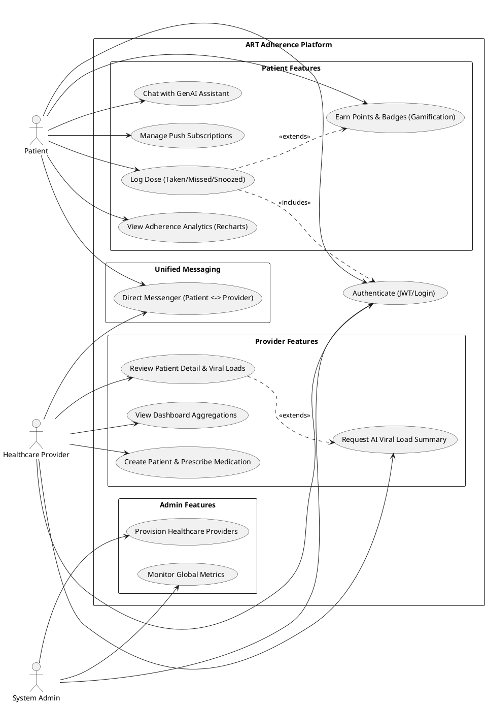
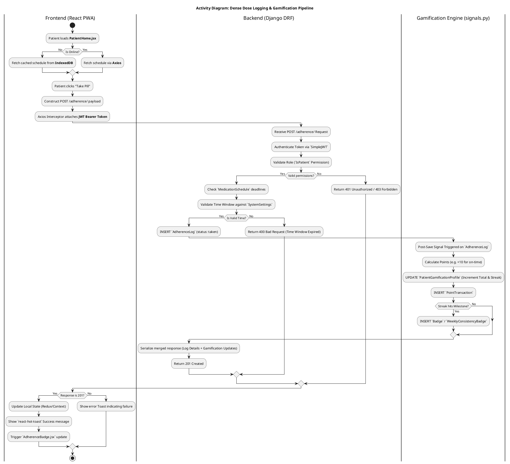
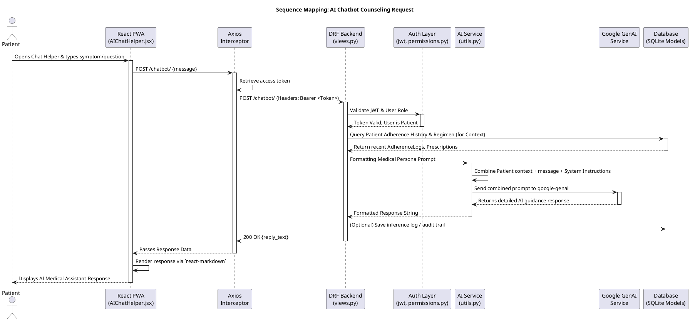
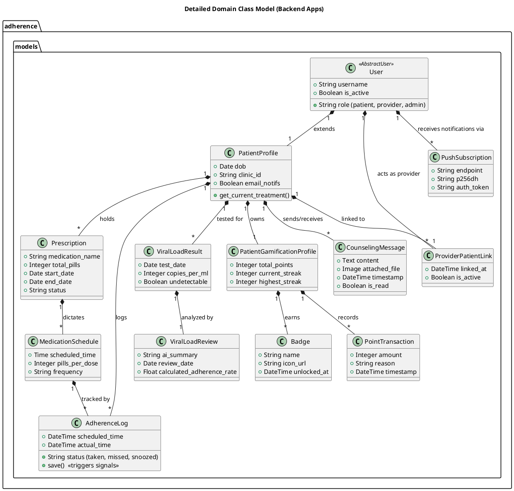
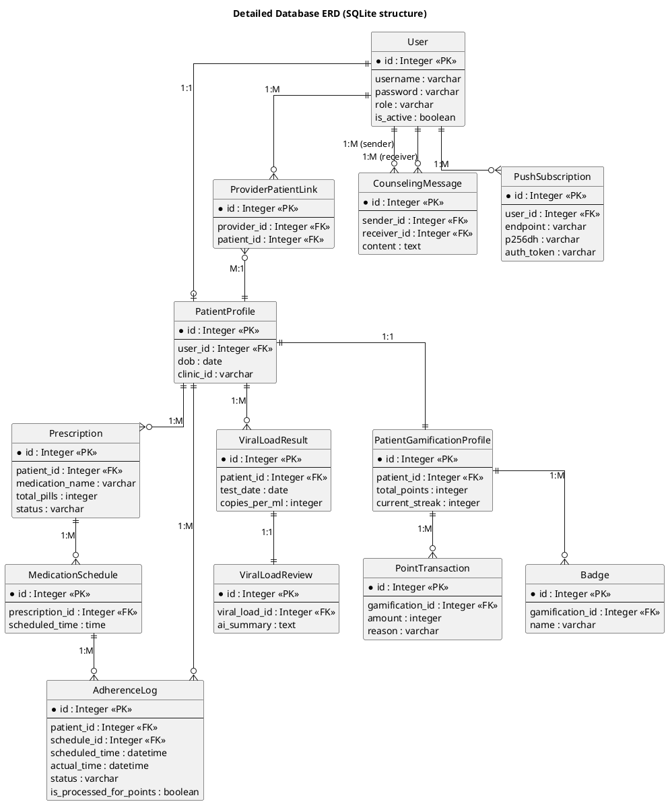

# ART System Detailed UML Diagrams

This document contains dense, highly detailed PlantUML code for various architectural and behavioral diagrams of the ART Adherence Platform, mapped comprehensively to the internal React frontend structures and Django DRF backend models.

## 1. Context Diagram (Level 0)

```plantuml
@startuml
!include https://raw.githubusercontent.com/plantuml-stdlib/C4-PlantUML/master/C4_Context.puml

title System Context Diagram - ART Adherence Platform (Detailed)

Person(patient, "Patient", "Uses mobile PWA to log pills, chat with AI, view adherence analytics, and earn rewards.")
Person(provider, "Healthcare Provider", "Uses desktop web dashboard to manage prescriptions, review viral loads, and monitor adherence metrics.")
Person(admin, "System Administrator", "Provisions users and configures system settings.")

System_Boundary(artSystem, "ART Adherence System") {
    System(frontend, "Frontend PWA (React/Vite)", "SPA providing role-based layouts, offline capabilities (Service Workers & IDB), and real-time UI updates.")
    System(backend, "Backend API (Django/DRF)", "RESTful API handling clinical logic, JWT Auth, gamification signals, and data aggregations.")
}

System_Ext(genai, "Google GenAI API", "Generates contextual adherence counseling and chatbot responses.")
System_Ext(push, "Web Push Service (VAPID)", "Dispatches browser notifications for scheduled doses.")

Rel(patient, frontend, "Interacts with PatientHome, UI, and Chats", "HTTPS")
Rel(provider, frontend, "Interacts with ProviderDashboard, Patient details", "HTTPS")
Rel(admin, frontend, "Interacts with AdminDashboard", "HTTPS")

Rel(frontend, backend, "Makes REST API calls (Axios/JWT)", "HTTPS/JSON")
Rel(frontend, push, "Registers Service Worker for push notifications", "W3C Push API")

Rel(backend, genai, "Sends prompts & history for AI summarization", "REST/gRPC")
Rel(backend, push, "Triggers pywebpush notification payloads", "HTTPS")
@enduml
```

## 2. Use Case Diagram



## 3. Activity Diagram (Dose Logging & Gamification Pipeline)



## 4. Sequence Diagram (AI Chatbot Counseling Request)



## 5. Class Diagram (System Class Models)



## 6. Entity Relationship Diagram (ERD)


